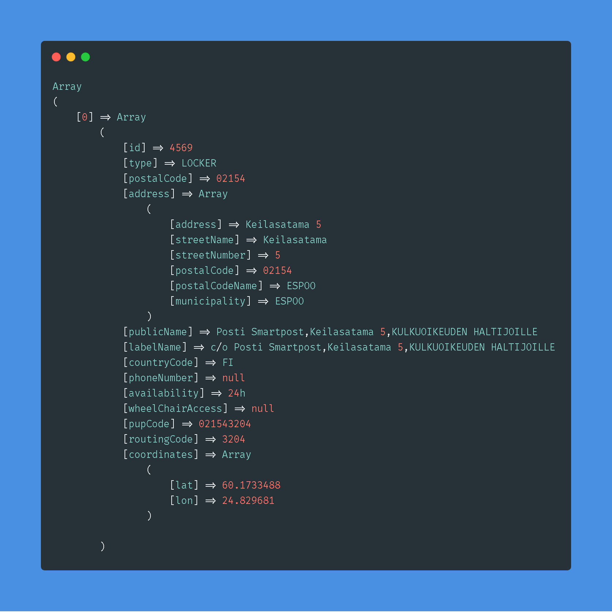

# posti-location-service
Unofficial PHP client for Posti location service. Check API documentation https://api.posti.fi/api-locationservice.html

## API link
https://locationservice.posti.com/api/2/location

## Installation
 - Run <code>composer install</code>

## Function examples

Function | Use
-------- | ---
`getLocationsByCity('Helsinki')` | Search by city
`getLocationsByZipCode(13100)` | Search by area code
`getLocationsByMunicipality('Uusimaa')` | Search by municipality
`getLocationsByPupCode(021543204)` | Search by PuPcode
`getAllLocations('FI')` | Search by country
`getLocationsByStrictZipCode(13100, true)` | Search by exact zip code

Check objects/Locations.php for all functions

## Example output

## Extra params
- To get raw data(original) add 'Raw' to any function in the end e.g `getLocationsByCityRaw(string $city)`
- To change output language add second parameter `string '$lang'` in `new Locations($apiUrl, $lang)`
  supported languges are [fi, sv, en]
  
